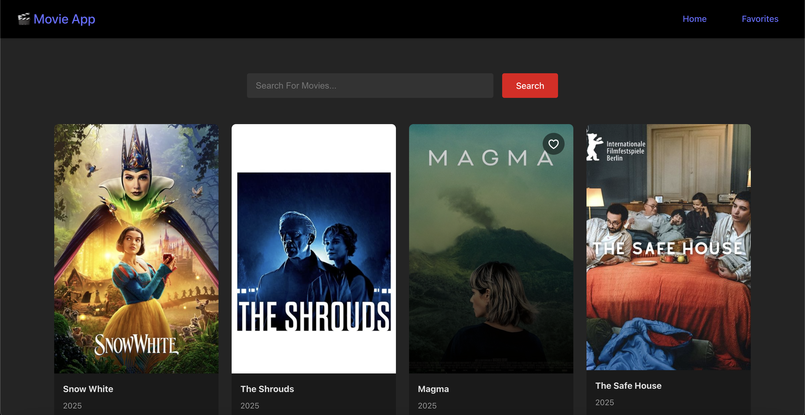

# Movie App

A movie discovery application built with React and Vite, integrating with the TMDB API. Browse popular movies, search films, and manage your favorites with persistent local storage.

Website Link : https://movie-list-113.netlify.app/

 <!-- Add your screenshot -->

## Features

- Browse popular movies
- Search movies by title
- Add/remove favorites
- Responsive design
- Persistent favorites (localStorage)

## Tech Stack

- **Frontend**: React
- **Routing**: React Router v7
- **Styling**: CSS Modules
- **State Management**: Context API
- **API**: [The Movie Database (TMDB)](https://www.themoviedb.org/)
